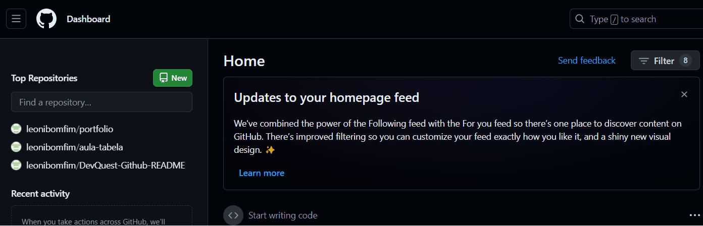

# Aula GitHub Readme
Aula sobre criação de um README file dentro de um repositório no GitHub.🤖

[]

## Tecnologias utilizadas
- HTML
- CSS
- JavaScript

## Como Usar
1. Clone o projeto no GitBash;
```
git clone <url do projeto>
```

2. Acesse a pasta;
``` 
cd DevQuest-Github-README
```


